---
hide:
  - navigation
---

{ .banner }

# Modulino MicroPython

This package lets you connect to Arduino Modulinos from MicroPython, read their data and control them.

## Installation

The easiest way to install the library is the
[Arduino MicroPython Package Installer](https://labs.arduino.cc/en/labs/micropython-package-installer).
Connect your board, search for **Modulino** and click *Install*.

Alternatively, install it from the command line with `mpremote`:

```bash
mpremote mip install github:arduino/modulino-mpy
```

## Quick start

```python
from modulino import ModulinoPixels, ModulinoColor

pixels = ModulinoPixels()
pixels.set_all_color(ModulinoColor.GREEN).show()
```

New here? Start with [Getting started](getting-started.md).

## Modulinos

<div class="grid cards" markdown>

-   [{ .card-illustration }](modulinos/buttons.md)

    **[Buttons](modulinos/buttons.md)**

    ---

    Three buttons with LEDs.

-   [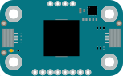{ .card-illustration }](modulinos/buzzer.md)

    **[Buzzer](modulinos/buzzer.md)**

    ---

    A piezo speaker.

-   [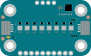{ .card-illustration }](modulinos/pixels.md)

    **[Pixels](modulinos/pixels.md)**

    ---

    8 RGB LEDs.

-   [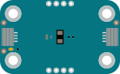{ .card-illustration }](modulinos/distance.md)

    **[Distance](modulinos/distance.md)**

    ---

    Time-of-Flight distance sensor.

-   [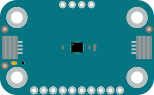{ .card-illustration }](modulinos/movement.md)

    **[Movement](modulinos/movement.md)**

    ---

    Acceleration, rotation and steps.

-   [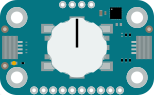{ .card-illustration }](modulinos/knob.md)

    **[Knob](modulinos/knob.md)**

    ---

    Rotary encoder with a button.

-   [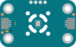{ .card-illustration }](modulinos/thermo.md)

    **[Thermo](modulinos/thermo.md)**

    ---

    Temperature and humidity.

-   [{ .card-illustration }](modulinos/latch-relay.md)

    **[Latch Relay](modulinos/latch-relay.md)**

    ---

    Switch devices on and off.

-   [{ .card-illustration }](modulinos/joystick.md)

    **[Joystick](modulinos/joystick.md)**

    ---

    X/Y axis and a button.

-   [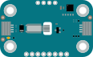{ .card-illustration }](modulinos/vibro.md)

    **[Vibro](modulinos/vibro.md)**

    ---

    A vibration motor.

-   [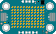{ .card-illustration }](modulinos/led-matrix.md)

    **[LED Matrix](modulinos/led-matrix.md)**

    ---

    A 12×8 LED matrix.

-   [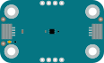{ .card-illustration }](modulinos/light.md)

    **[Light](modulinos/light.md)**

    ---

    Lux, color and infrared light.

-   [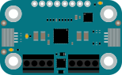{ .card-illustration }](modulinos/motors.md)

    **[Motors](modulinos/motors.md)**

    ---

    DC and stepper motors.

-   [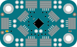{ .card-illustration }](modulinos/hub.md)

    **[Hub](modulinos/hub.md)**

    ---

    Several Modulinos of the same type.

</div>

## Supported boards

Any board that has I2C and can run a modern version of MicroPython is supported.
On Arduino boards the correct I2C interface is detected automatically. On other boards
you have to pass the I2C interface, e.g. `ModulinoPixels(I2C(0))`.
Boards without a Qwiic connector need a Qwiic to Dupont cable.
