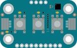

# Modulino Buttons

{ .modulino-illustration }

A three-button Modulino with an LED next to each button. React to presses, releases and long presses or query the button state directly.

```python
from modulino import ModulinoButtons

buttons = ModulinoButtons()
```

## Examples

=== "buttons.py"

    ```python
    --8<-- "examples/buttons.py"
    ```

Run an example with `mpremote connect mount src run examples/<name>.py`.

## API reference

::: modulino.buttons.ModulinoButtons

::: modulino.buttons.ModulinoButtonsLED
