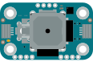

# Modulino Joystick

{ .modulino-illustration }

Read the X/Y axis position and button state of a joystick.

```python
from modulino import ModulinoJoystick

joystick = ModulinoJoystick()
```

## Examples

=== "joystick.py"

    ```python
    --8<-- "examples/joystick.py"
    ```

Run an example with `mpremote connect mount src run examples/<name>.py`.

## API reference

::: modulino.joystick.ModulinoJoystick
