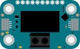

# Modulino Latch Relay

{ .modulino-illustration }

Control a latching relay to switch devices on and off.

```python
from modulino import ModulinoLatchRelay

latch_relay = ModulinoLatchRelay()
```

## Examples

=== "latch_relay.py"

    ```python
    --8<-- "examples/latch_relay.py"
    ```

Run an example with `mpremote connect mount src run examples/<name>.py`.

## API reference

::: modulino.latch_relay.ModulinoLatchRelay
